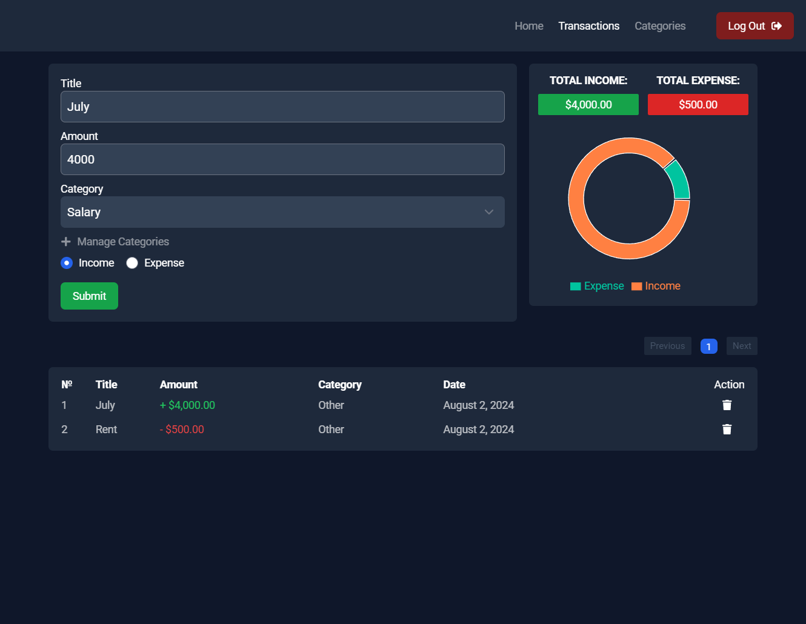

<h1 align="center" id="title">Wisely</h1>

<p align="center"></p>

<p id="description">This is a budget manager app with full user authentication and user friendly UI/UX</p>

  
  
<h2>🧐 Features</h2>

Here're some of the project's best features:

*   Authentication
*   Registration
*   CRUD operations
*   Pagination
*   Chart

<h2>🛠️ Installation Steps:</h2>

<p>1. Clone the project</p>

```
git clone https://github.com/oiibar/Wisely.git
```

<p>2. Navigate to the client folder</p>

```
cd Wisely/client
```

<p>3. Install client-side packages</p>

```
npm i
```

<p>4. Run the client</p>

```
npm run dev
```

<p>5. Navigate to the server folder</p>

```
cd Wisely/server
```

<p>6. Install server-side packages</p>

```
npm i
```

<p>7. Run the server</p>

```
npm run start:dev
```

  
<h2>💻 Built with</h2>

Technologies used in the project:

*   ReactJS
*   NestJS
*   TypeScript
*   PostgreSQL
*   Rechart
*   TailwindCSS
*   RESTful API
*   Redux Toolkit

<p>Here are some previews: </p>



<h2>💖Like my work?</h2>

Feel free to contact me<p><a href="contact-me-neon.vercel.app">contact-me-neon.vercel.app</a></p>
